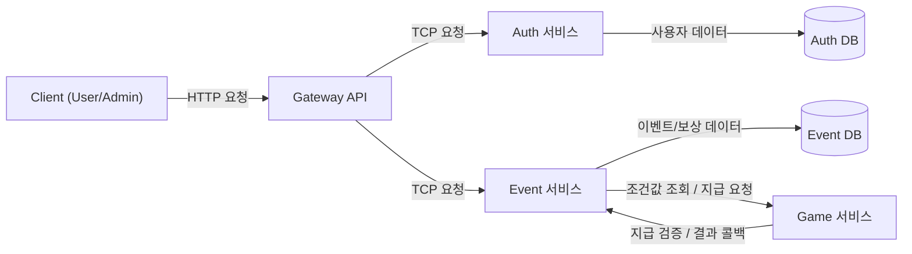
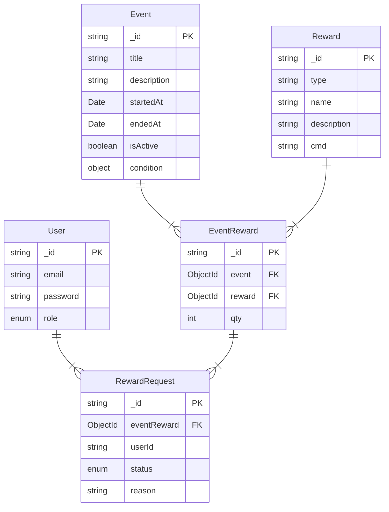
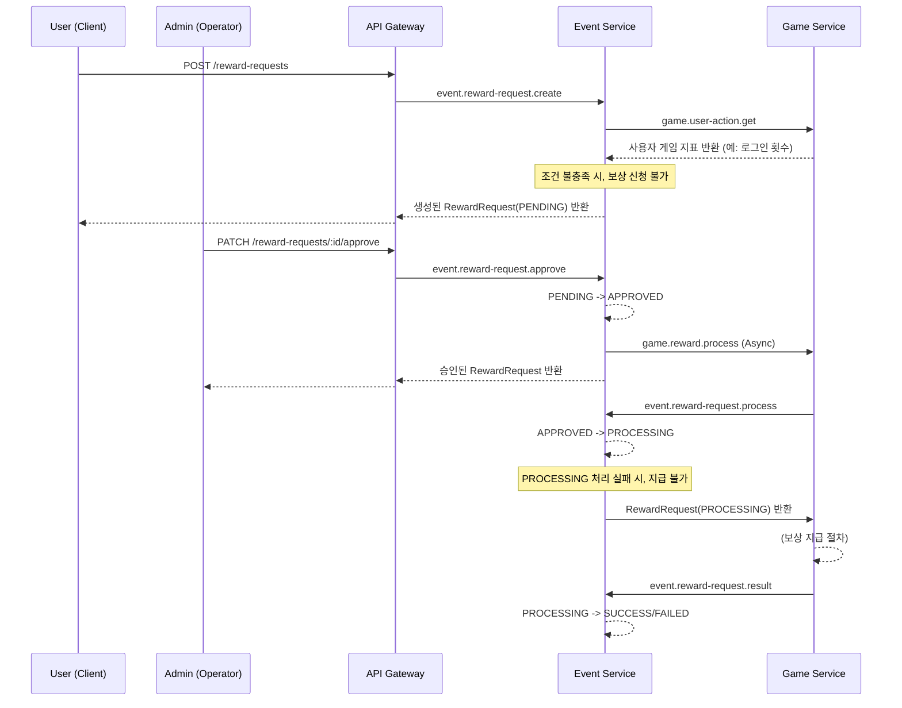

# 이벤트 / 보상 관리 플랫폼

## 아키텍처



### 주요 컴포넌트

1. Gateway API

- 목적: HTTP 엔드포인트가 있는 API 진입점
- 기능: 적절한 마이크로서비스로 라우팅, JWT 인증, 역할 기반 가드

2. Auth 서비스

- 기능: 회원가입, 로그인, 사용자 역할 변경

3. Event 서비스

- 기능: 이벤트 생성/목록 조회, 보상 관리, 이벤트-보상 관계 설정, 보상 지급
- 하위 모듈:
  - EventModule: 이벤트 관리
  - RewardModule: 보상 정의
  - EventRewardModule: 이벤트와 보상 연결
  - RewardRequestModule: 사용자 보상 요청 처리
  - UserActionModule: 이벤트 조건에 사용할 사용자 행동 관리

4. Game 서비스

- 기능: 게임 보상 지급 및 사용자 데이터 조회

### 코드 구조

NestJS에서 권장하는 구조를 따릅니다:

- Controller: 들어오는 요청 라우팅
- Service: 비즈니스 로직 담당
- Repository: 데이터 접근 관리
- DTO: 데이터 구조 정의 및 검증
- Schema: 데이터베이스 모델 정의

## 데이터 모델링



### 인덱싱

- RewardRequest
  - 중복 보상 요청 방지를 위해 userId + eventReward을 복합 인덱싱으로 Unique 처리
  - 조회 성능을 위해 userId 인덱싱(ref가 아니므로 별도 인덱싱 필요)
- EventReward
  - 중복 이벤트 보상 생성 방지를 위해 Event + Reward을 복합 인덱싱으로 Unique 처리

## 주요 구현 포인트

### 보상 지급 플로우



지급 요청을 받는 서비스와 실제 지급이 이루어지는 서비스가 분리되어있는 MSA 시스템으로 가정하였습니다. 중복 지급을 방지하기 위해 PROCESSING 처리 절차를 추가하였고, 결과를 전달받기 위해 Callback 기능을 구현하였습니다.

### 이벤트 조건 검사

- 세밀하면서 자유로운 조건을 설정할 수 있도록 조건식에 트리 자료 구조를 사용하였습니다.
- 트리 구조의 조건들을 재귀 호출을 이용하여 평가하도록 구현하였습니다.
- 오버헤드 방지를 위해 리프 노드 개수, 트리 뎁스에 제한이 있습니다.

```typescript
// 조건식 구조
interface Condition {
  op: 'AND' | 'OR' | '==' | '>=' | '<=';
  children?: Condition[];
  cmd?: string;
  field?: string;
  value?: number;
}

// 조건식 예제
const condition = {
  op: 'AND',
  children: [
    {
      op: '>=',
      cmd: 'user.action.get',
      field: 'login_count',
      value: 5,
    },
    {
      op: '<=',
      cmd: 'user.action.get',
      field: 'referral',
      value: 3,
    },
  ],
};
```

조건 평가 로직은 다음과 같은 방식으로 동작합니다:

1. 조건 트리를 재귀적으로 탐색합니다.
2. AND/OR 같은 연산자 노드는 자식 조건들을 평가한 후, 그 결과를 논리적으로 결합합니다.
3. ==, >=, <= 등의 비교 연산 노드는 실제 값을 게임 서비스에서 조회하여 조건을 판단합니다.
4. 각각의 평가 결과는 트리 상위 노드로 전달되어 최종 판단에 반영됩니다.

###

```typescript
// 보상 요청 승인 로직
const updated = await this.rewardRequestRepository.findOneAndUpdateWithPopulate(
    { _id: rewardRequestId, status: RewardRequestStatus.PENDING },
    { status: RewardRequestStatus.APPROVED },
    { new: true },
    [{ path: 'eventReward', populate: [{ path: 'event' }, { path: 'reward' }] }]
);
if (!updated) {
    const exists = await this.rewardRequestRepository.exists({ _id: rewardRequestId });
    if (!exists) {
    throw new RpcException({ message: 'RewardRequest not found', status: 404 });
    }
    throw new RpcException({ message: 'Only PENDING requests can be approved', status: 400 });
}

...

await firstValueFrom(this.gameClient.send(reward.cmd, {
    userId: updated.userId,
    ...
    type,
    name,
    qty,
    processing: { cmd: 'event.reward-request.process', payload: updated._id },
    callback: { cmd: 'event.reward-request.result', payload: {
        rewardRequestId: updated._id,
    } },
}));
```

- PENDING 중인 보상 요청에 동시 접근하여 APPROVE 시 중복 지급이 발생할 수 있습니다.
- findOneAndUpdate로 조회와 업데이트를 원자적으로 수행하여 위 문제를 방지하였습니다.
- 뒤에 오는 exists 체크를 한 세션(트랜잭션)에서 수행하지 않은 이유는, 일관성 보장의 목적이 아니기 때문입니다.
  - UX를 위해 추가한 로직으로 트랜잭션 사용이 과할 수 있다 판단하였습니다.
  - 다른 로직 모두 같은 기조로 작성하였습니다.
- 추가로, game 서비스에 보내는 지급 요청 또한 APPROVE와 트랜잭션으로 묶지 않았습니다.
  - 만약 APPROVE 이후 에러가 발생한다면 수동으로 정확한 원인 판단이 필요하다고 생각했습니다.
  - 왜냐하면, 서비스가 분리되어있기 때문에 실제로는 지급이 완료되고 PENDING 상태로 롤백될 수 있기 때문입니다.

### HTTP<->TCP 이종간의 연동

**Gateway**

-

## 실행 & 테스트

**실행**

```bash
docker-compose up
```

**E2E 테스트**

```bash
npm run test:e2e:auth
npm run test:e2e:event
```

## 회고
